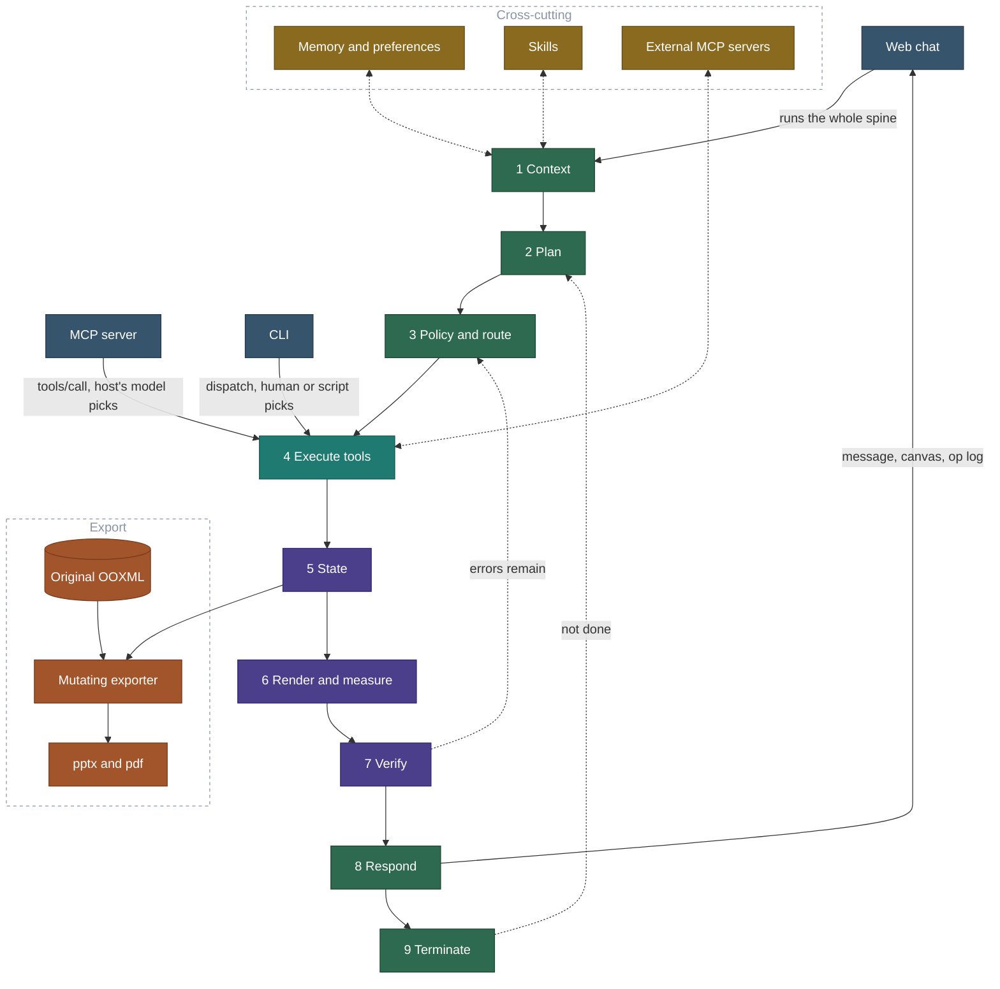
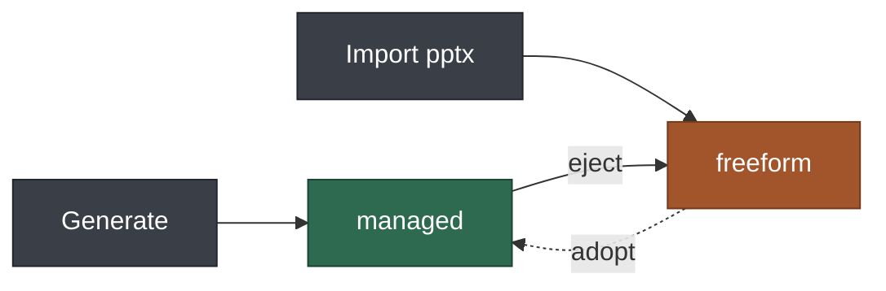
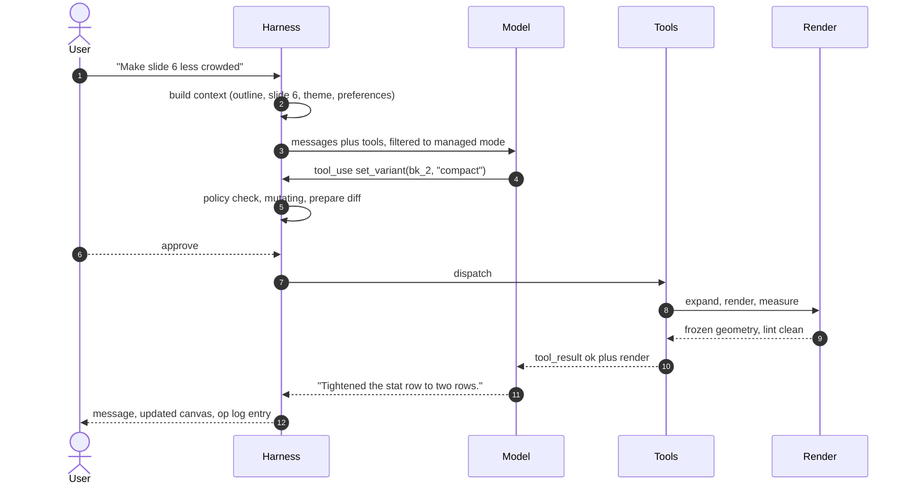

# PPT Harness — Architecture

A harness for creating, editing, and inspecting presentations by talking to an LLM,
covering both decks it generates and decks the user imports.

Explicit schemas, catalogs, and signatures: **[DESIGN.md](DESIGN.md)**.

---

## Principles

1. **The model never writes a coordinate.** On generated slides, components own geometry.
   On imported slides, constraint operations own it. Raw frames exist only as a logged,
   flagged escape hatch.
2. **Nothing is claimed to work until it has been rendered and measured.** Every write
   returns the resulting render; exports are verified against real font metrics.
3. **Prevent, don't repair.** A lint rule that fires often is a bug in a component schema.
   The cheapest failure is a rejected write that never rendered.

---

## System



**Where each interface enters is the whole point.** Web chat enters at stage 1 and runs the
spine end to end, which is why it is the only interface with an edge back from stage 8. The
MCP server and the CLI enter at stage 4 — they hold a `Session` and the tool router, and
nothing else; their results return from the tool call itself, not from a Respond stage.
Green stages are the agent loop; teal and purple are the tool core every interface shares.
**The nine numbered stages are the harness**; blue is an interface, orange is a file on
disk, gold is cross-cutting.

| # | Stage | Responsibilities | Owner |
|---|---|---|---|
| 1 | Context | Outline always; focused slides on demand; theme, memory, preference profile | loop |
| 2 | Plan | Decompose the request, sequence steps | loop |
| 3 | Policy and route | Mode gate (managed vs freeform), approval diff for mutations | loop |
| 4 | Execute tools | Dispatch, validate arguments, normalize results | core |
| 5 | State | Slides and theme; op log in turn transactions; single writer | core |
| 6 | Render and measure | Expand blocks to boxes; measure analytically at ~1ms. Preview is a separate, slower path | core |
| 7 | Verify | Budget gate, analytic lint, repair ladder | core |
| 8 | Respond | Message, diff, updated canvas | loop |
| 9 | Terminate | Goal met, no errors, cap reached, or signature repeats | loop |

**Only web chat runs all nine.** `core/loop.py` is imported by the web adapter and
nothing else; the MCP server and the CLI hold a `Session` and the router, and enter at
stage 4. Under MCP the loop stages still happen — they just belong to the *host's* model,
which is why the harness cannot own the context pyramid there. Under the CLI no model is
involved at all: a human or a script names the tool.

This is the reason verification rides inside every mutating tool's return value instead of
being a stage the caller invokes. Stages 4–7 are the only ones the harness is guaranteed to
own, so soundness has to live there.

**Tool set** — mode-gated, transport-agnostic:

```
managed    add_slide  add_block  set_slots  set_variant  set_component
           set_override  remove_block
freeform   align  distribute  match_size  snap_to_grid  nudge
           fit_box_to_text  restyle  set_frame
shared     get_outline  get_slide  list_components  get_theme  set_text
           reorder  delete_slide  eject_slide  adopt_slide
           render  lint  review_deck  export  undo  redo
```

Two loops matter more than the forward path. **7 → 3** is repair: lint errors re-enter at
the policy gate and walk the ladder, capped at 2–3 rounds and stopped early if an error
signature repeats. **9 → 2** is replanning when the goal isn't met. Everything else is one
pass.

---

## The deck model in one picture

Slides carry a **mode**, and the tool surface is gated on it.



`eject` is one-way per slide. `adopt` requires classifier confidence and user confirmation,
because it reflows the slide.

A managed slide is a **layout frame plus ordered blocks**, each block a component with
filled slots — not one component per slide, which could not express the hybrid slides real
decks are made of. A freeform slide is an overlay on the imported OOXML: shapes the harness
understands are editable, the rest are preserved opaque.

A deck is legitimately two-tier. That is honesty about what the system understands, not a
defect.

---

## A turn

Worked example — *"Make slide 6 less crowded."*



**One tool call.** A shape-manipulation harness needs roughly seven for the same request —
inspect, render, analyze layout, move, resize, re-render, re-check — because a model
allowed to move boxes by pixels can produce a broken layout, so it must look at the result
and correct. The component model makes that class of error unrepresentable, so the loop
usually doesn't run. That is the whole argument for principle 1.

Verification is part of the write's response, not a follow-up call the model might skip —
which matters most under MCP, where you cannot force a host's model to call `screenshot`.

---

## Subsystems

| Subsystem | Responsibility | Detail |
|---|---|---|
| **Deck state** | Slides, theme, invertible ops in turn transactions, single writer | [DESIGN §1](DESIGN.md) |
| **Theme** | Roles not colors; validated once at load, so contrast can't fail later | [DESIGN §2](DESIGN.md) |
| **Components** | 16 components with variants, degradation chains, and slot budgets | [DESIGN §3](DESIGN.md) |
| **Tools** | Mode-gated registry; no coordinates, no fonts, no positions | [DESIGN §4](DESIGN.md) |
| **Verification** | Three gates — budget, analytic lint, export fidelity — plus a repair ladder | [DESIGN §5](DESIGN.md) |
| **Render/export** | Preview is the export, rendered; mutate the original package, never rebuild | [DESIGN §6](DESIGN.md) |
| **Import** | Theme extraction first, adoption as a user-visible proposal | [DESIGN §7](DESIGN.md) |
| **Context** | Five-level pyramid; memory for what was said, preferences for what was done | [DESIGN §8](DESIGN.md) |
| **Skills** | Playbooks users invoke; invariants the system injects | [DESIGN §9](DESIGN.md) |

---

## Load-bearing choices

**Python, because the file format is the hard part.** `python-pptx` read-modify-write on
real files is what makes imported decks tractable; nothing in JS is close.

**Export mutates, never rebuilds.** Regenerating an imported file destroys SmartArt,
animations, transitions, media, and comments. State is an overlay on the real package.

**The preview is the export, rendered.** Deck state goes out through the ordinary
exporter, a real renderer turns that file into a PDF, and pages are rasterised on demand.
Preview cannot drift from export because it *is* the export — and SmartArt, gradients and
video posters render correctly for free, because nothing reimplements them.

**Measurement never touches a renderer.** It is analytic — real font metrics, the expander's
boxes — at ~1ms, and works where no Office is installed. Only a person looking at a picture
pays the ~1s. The verification loop is measurement, so it keeps its budget.

**Autofit off, `spcPts` not `spcPct`, insets explicit.** These no longer defend the
preview — the preview is the file — but they still defend the *recipient's* copy, whose
PowerPoint may substitute fonts or resolve line spacing differently.