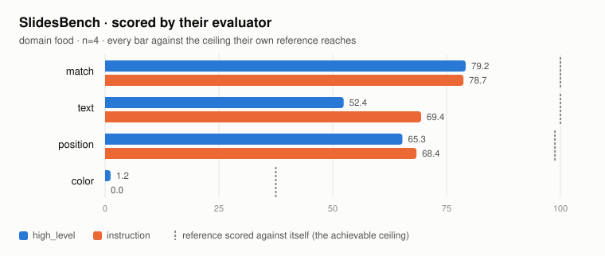
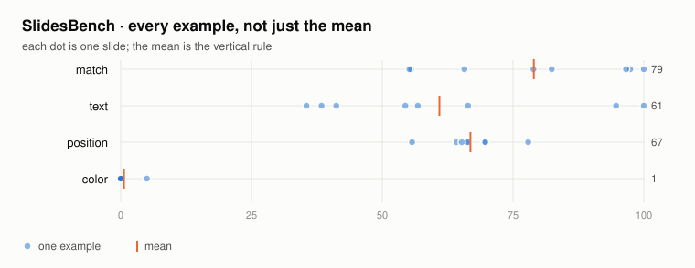

# Benchmark results

Generated by `ppt-harness bench publish`. Every figure is drawn against the ceiling that
figure can actually reach, and every JSON that produced a chart is in `results/`.

## SlidesBench

| dimension | high_level | instruction | ceiling | reading |
|---|---|---|---|---|
| match | 79.2 | 78.7 | 100.0 | fair — did the right blocks get built |
| text | 52.4 | 69.4 | 100.0 | fair — variant-dependent, see below |
| position | 65.3 | 68.4 | 98.8 | diagnostic — we derive geometry, never copy coordinates |
| color | 1.2 | 0.0 | 37.5 | diagnostic — their metric compares `FillFormat` objects |

## Round trip · no model, no judge

| corpus | decks | opened | preserved | slides | opaque shapes |
|---|---|---|---|---|---|
| corpus | 3 | 3 (100%) | **3/3** (100%) | 15 | 4 |

## Task suite · measured, ours

| tasks | met brief | fit rate | refused writes | violations |
|---|---|---|---|---|
| 1/1 | 1/1 | **1.000** (4/4 slides) | 0 of 18 | 0 |

## What these numbers do not say

- **Nothing here is a comparison to another system.** Our score came from
  `deepseek-v4-flash`; published baselines used other models. Until the same model is run
  through a no-harness control, a gap measures the model and the harness together.
- **`color` and `position` are diagnostics, not grades.** SlidesBench scores similarity to a
  reference slide's coordinates and fills; this harness derives geometry from components and
  exposes no tool that accepts a coordinate, so a low score restates a design decision.
- **The ceiling is not 100.** Their reference deck scored against itself reaches 0–37 on
  colour, which is why every chart draws it.
